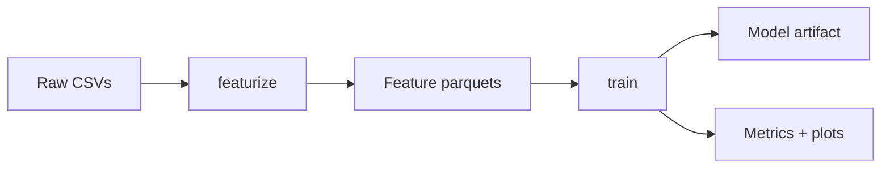

# Home Credit Default Risk Prediction

Production MLOps pipeline for the [Home Credit Default Risk](https://www.kaggle.com/competitions/home-credit-default-risk) Kaggle competition — predicts whether an applicant will default on a loan (`TARGET=1`).

[](https://python.org)
[](https://docs.astral.sh/uv)
[](https://dvc.org)
[](https://mlflow.org)
[](https://fastapi.tiangolo.com)
[](https://docs.astral.sh/ruff)
[]()
[](LICENSE)

[Overview](#overview) • [Features](#features) • [Quickstart](#quickstart) • [Project layout](#project-layout) • [Pipeline](#pipeline) • [API](#api) • [Development](#development) • [Configuration](#configuration)

---

## Overview

This project implements a complete MLOps pipeline for credit default prediction:

- **Ensemble model**: LightGBM + XGBoost blended with nested cross-validation weight search
- **Probability calibration**: Held-out split calibration with automatic sigmoid/isotonic selection
- **SHAP explainability**: Per-prediction explanations with correct probability-scale attribution
- **Zero-leakage training**: All transforms fit on training folds only — nothing crosses the train/validation/test boundary
- **Reproducible pipeline**: DVC tracks data and model artifacts through Dagshub storage
- **Experiment tracking**: MLflow (Dagshub-managed) logs parameters, metrics, and model artifacts
- **Model registry**: Single PyFunc artifact wraps the full ensemble pipeline for inference
- **Production API**: FastAPI service with request logging, Prometheus metrics, and structured responses

> [!NOTE]
> This refactor originated from a set of exploratory notebooks. The production code fixes 5 critical data leakage bugs and 16 warnings identified during review — see the complete bug fix ledger in [`PLAN.md`](PLAN.md).

## Features

- **Zero-leakage training** — Encoders, feature selection, blend weights, and calibrator are all fold-isolated by design
- **Stratified k-fold CV** — 5-fold cross-validation with per-fold early stopping
- **Nested-CV model blending** — Blend weights are tuned on inner CV folds; the outer OOF provides an honest AUC estimate
- **Bayesian target encoding** — Fold-safe target encoding with configurable smoothing
- **NaN-aware drift monitoring** — PSI and KS statistics track NaN-rate shifts separately (a real signal in credit data); API endpoint + CLI script for scheduled checks
- **Index-aligned fairness audit** — Demographic parity metrics computed via `SK_ID_CURR` joins, not fragile `.values` assignment
- **SHAP explainability** — Correct sigmoid→calibrator pipeline; SHAP values averaged across all fold models
- **Feature name assertion** — Column order mismatch fails fast at inference time, preventing silent wrong predictions
- **Reproducible DVC pipeline** — Two-stage pipeline (`featurize → train`) with Dagshub remote storage

## Stack

| Layer | Implementation |
|---|---|
| Language | Python 3.11 |
| Package manager | [uv](https://docs.astral.sh/uv) |
| Configuration | [Hydra](https://hydra.cc) (hierarchical YAML composition) |
| Data versioning | [DVC](https://dvc.org) → Dagshub storage |
| Experiment tracking | [MLflow](https://mlflow.org) (Dagshub-managed) |
| Model registry | MLflow Model Registry — single [PyFunc](https://mlflow.org/docs/latest/python_api/mlflow.pyfunc.html) ensemble artifact |
| API framework | [FastAPI](https://fastapi.tiangolo.com) |
| Base learners | [LightGBM](https://lightgbm.readthedocs.io) + [XGBoost](https://xgboost.readthedocs.io) |
| Calibration | Platt scaling + isotonic regression (scikit-learn) |
| Explainability | [SHAP](https://shap.readthedocs.io) TreeExplainer |
| CI/CD | ruff, mypy, pytest, pre-commit, GitHub Actions |
| Containerization | Multi-stage Docker image (API) |
| Monitoring | Prometheus metrics, structured JSON logging (structlog) |

## Quickstart

### Prerequisites

- [uv](https://docs.astral.sh/uv/getting-started/installation/) (install once: `powershell -c "irm https://astral.sh/uv/install.ps1 | iex"`)
- Kaggle API credentials (`~/.kaggle/kaggle.json`) to download the competition data
- A [Dagshub](https://dagshub.com) account for DVC remote + MLflow tracking

### Setup

```bash
# 1. Clone and install
git clone https://github.com/MohamedShakshak/Home-Credit-Default-Risk-Prediction.git
cd Home-Credit-Default-Risk-Prediction
uv sync

# 2. Configure Dagshub remote + MLflow (one-time)
uv run python scripts/init_dvc.py

# 3. Download competition data
uv run python scripts/download_data.py
# Extract the downloaded ZIP:
Expand-Archive -Path home-credit-default-risk.zip -DestinationPath data/raw -Force

# 4. Track data with DVC and push to remote
dvc add data/raw/
dvc push

# 5. Train and register the model
uv run python -m home_credit.train

# 6. Serve the API
uv run uvicorn home_credit.api.app:app --reload --host 0.0.0.0 --port 8000
```

## Project layout

```
├── configs/                          # Hydra configuration (data, model, train, api)
│   └── config.yaml                   #   Top-level composition
│
├── data/                             # DVC-tracked data
│   ├── raw/                          #   Raw CSV files (DVC-tracked)
│   ├── interim/                      #   Engineered features (DVC-tracked)
│   ├── processed/                    #   Processed data
│   ├── models/                       #   Model artifacts (DVC-tracked)
│   └── raw.dvc                       #   DVC metafile for raw data
│
├── src/home_credit/                  # Package source
│   ├── data/                         #   Loaders + per-table featurizers
│   ├── features/                     #   Encoders, selection, engineering
│   ├── models/                       #   LGB/XGB trainers, blender, calibrator
│   ├── evaluate/                     #   Metrics, drift monitor, fairness audit
│   ├── explain/                      #   SHAP explainability
│   ├── registry/                     #   MLflow client + PyFunc model wrapper
│   ├── api/                          #   FastAPI routes, schemas, middleware
│   ├── train.py                      #   Hydra training entrypoint
│   └── predict.py                    #   CLI scoring from registry
│
├── tests/                            # Test suite (12 files, 100+ tests)
├── scripts/                          # Utility scripts
│   ├── download_data.py              #   Kaggle data download
│   ├── init_dvc.py                   #   Dagshub remote setup wizard
│   └── seed_dagshub.py               #   .env generation helper
│
├── dvc.yaml                          # DVC pipeline definition
├── pyproject.toml                    # Dependencies, tool configs
└── PLAN.md                           # Bug-fix ledger (gitignored)
```

## Pipeline

The training pipeline is defined as a two-stage DVC workflow:



### Stage 1: Featurize

`uv run python -m home_credit.data.pipeline`

Loads all raw CSV files and applies the following feature engineering steps:

| Table | Engineered features | Description |
|---|---|---|
| Application | ~50 | Credit/income ratios, age/employment features, EXT_SOURCE interactions, social/document indicators, missing-value flags |
| Bureau | ~30 | Loan counts, credit sums, debt totals, overdue metrics, active-loan breakdowns |
| Bureau balance | ~10 | Payment status statistics, delinquency rates |
| Previous applications | ~20 | Approval/refusal rates, credit amounts, down-payment ratios |
| Installments | ~15 | Late-payment counts, payment ratios, underpayment rates |
| POS cash | ~12 | DPD statistics, completion rates, installment tracking |
| Credit card | ~16 | Utilization rates, drawing patterns, limit statistics |

Output: parquet files in `data/interim/`.

### Stage 2: Train

`uv run python -m home_credit.train data=raw model=blend`

Runs the full training pipeline:

1. **Stratified 5-fold CV** — Each fold trains a LightGBM and an XGBoost model with early stopping
2. **Nested-CV blending** — Blend weights are optimized using inner cross-validation to avoid overfitting the OOF metric
3. **Probability calibration** — OOF predictions are split into calibration-fit / calibration-eval halves; sigmoid and isotonic calibrators are compared on the held-out eval Brier score
4. **MLflow logging** — All parameters, per-fold metrics, confusion matrices, calibration curves, and SHAP importance plots are logged
5. **Model registration** — The ensemble (featurizers + fold models + blend weights + calibrator) is wrapped in a single PyFunc artifact and registered to the MLflow Model Registry as `Staging`

## API

Once a model is registered, serve it with:

```bash
uv run uvicorn home_credit.api.app:app --reload --host 0.0.0.0 --port 8000
```

### Endpoints

| Method | Path | Description |
|---|---|---|
| `POST` | `/predict` | Single applicant prediction |
| `POST` | `/predict_batch` | Batch prediction (list of applicants) |
| `POST` | `/predict_batch/csv` | Batch prediction from CSV upload |
| `POST` | `/explain` | Single prediction with SHAP explanation |
| `POST` | `/drift/report` | Upload reference + current CSV; per-feature PSI/KS/NaN-shift |
| `POST` | `/drift/report/json` | Same, with JSON payload |
| `GET` | `/health` | Service health check |
| `GET` | `/metrics` | Prometheus metrics |
| `GET` | `/docs` | Interactive API documentation (Swagger UI) |

### Example request

```bash
curl -X POST http://localhost:8000/predict \
  -H "Content-Type: application/json" \
  -d '{
    "SK_ID_CURR": 1001,
    "AMT_INCOME_TOTAL": 200000.0,
    "AMT_CREDIT": 500000.0,
    "AMT_ANNUITY": 55000.0,
    "AMT_GOODS_PRICE": 400000.0,
    "CODE_GENDER": "M",
    "CNT_FAM_MEMBERS": 3
  }'
```

### Example response

```json
{
  "SK_ID_CURR": 1001,
  "predicted_pd": 0.082,
  "decision": 0,
  "top_reasons": [
    {"feature": "EXT_SOURCE_2", "shap": -0.315},
    {"feature": "CREDIT_INCOME_RATIO", "shap": 0.142},
    {"feature": "EXT_SOURCE_3", "shap": -0.098}
  ]
}
```

## Development

### Commands

| Target | Command | Description |
|---|---|---|
| `make dev` | `uv sync` | Install dependencies |
| `make lint` | `ruff check src tests` | Lint with ruff |
| `make fmt` | `ruff format src tests` | Format with ruff |
| `make type` | `mypy src` | Type-check with mypy |
| `make test` | `pytest -m "not slow"` | Run fast tests |
| `make test-slow` | `pytest -m "slow"` | Run slow tests |
| `make ci` | lint + type + test | Full CI gate |
| `make serve` | `uvicorn home_credit.api.app:app` | Start API server |
| `make repro` | `dvc repro` | Reproduce DVC pipeline |
| `make dvc-dag` | `dvc dag` | Show pipeline graph |

### Testing

```bash
# Fast tests (default)
make test

# All tests including integration
make test-all

# Single test file
uv run pytest tests/test_api.py -v
```

Pre-commit hooks (`pre-commit install`) run ruff, ruff-format, mypy, and nbstripout on every commit.

### Code quality

- **ruff** for linting and formatting (line length: 100, target: Python 3.11)
- **mypy** with strict mode for type safety
- **pytest** with coverage threshold (minimum 50%, currently ~76%)
- Pre-commit ensures all checks pass before committing

## Configuration

The project uses [Hydra](https://hydra.cc) for hierarchical configuration:

```bash
# Override any config at the command line
uv run python -m home_credit.train data=raw model=blend train.seed=123

# Override model hyperparameters
uv run python -m home_credit.train model.lgb.n_estimators=1000 model.xgb.max_depth=4
```

Key configuration files:

| File | Purpose |
|---|---|
| `configs/config.yaml` | Top-level composition and constants |
| `configs/data/raw.yaml` | File paths, target column, ID column |
| `configs/data/processed.yaml` | CV split parameters, calibration split |
| `configs/model/lgb.yaml` | LightGBM hyperparameters |
| `configs/model/xgb.yaml` | XGBoost hyperparameters |
| `configs/model/blend.yaml` | Blend method, calibrator settings, threshold |
| `configs/api/local.yaml` | Server host, port, model URI |

## Data versioning

[DVC](https://dvc.org) tracks all data and model artifacts. The remote is configured to use [Dagshub](https://dagshub.com) storage.

```bash
# Set up the remote (one-time)
uv run python scripts/init_dvc.py

# Pull data from remote
dvc pull

# Push data to remote
dvc push

# Check pipeline status
dvc status

# Reproduce the full pipeline
dvc repro

# View the pipeline graph
dvc dag
```

## Experiment tracking

[MLflow](https://mlflow.org) (Dagshub-managed) logs every training run:

- **Parameters**: All Hydra config values (flattened), git hash, data version hashes
- **Metrics**: Per-fold AUC/Brier, blended OOF AUC, calibrated AUC/Brier/KS, expected loss
- **Artifacts**: Feature importance plots, calibration curves, ROC curves, SHAP summaries, model card
- **Model registry**: Every run registers a PyFunc artifact to the `home_credit_default` model in the registry; default stage is `Staging`

To view experiments, open your Dagshub repository and navigate to the **Experiments** tab.
